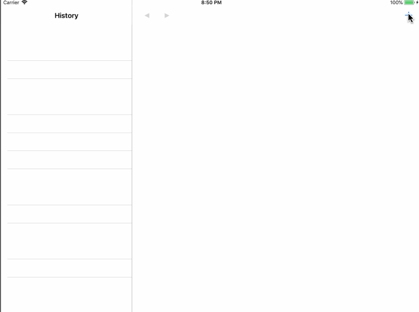

# The Do List - A MVVM Architecture To-Do List built with RxSwift

### Features:
- MVVM Architecture
- Most of the code  built with a generic `Resource` type for future development consideration
  - A `Resource` is `Equatable & Hashable & Codable`
- Undo/Redo functionality for all CRUD operations
- Animated Insertion/Deletion by diffing
- Saving to disk

### [A short blog about this code](http://bitwit.ca/blog/2018-06-01-adventures-in-mvvm-with-rxswift/)

### Future considerations for fun and profit 🎉:
- Implement syncing with a web service
- More operations that challenge MVVM/RxSwift
  - e.g. Timer countdown on expiring item
- Performance tweaking
